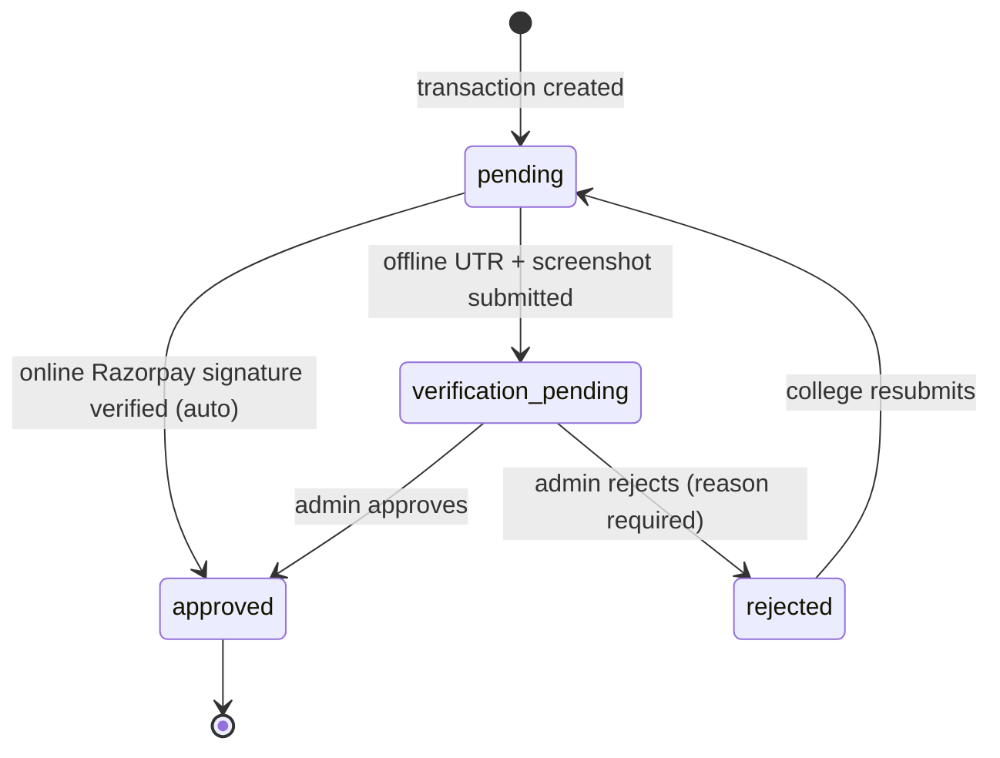
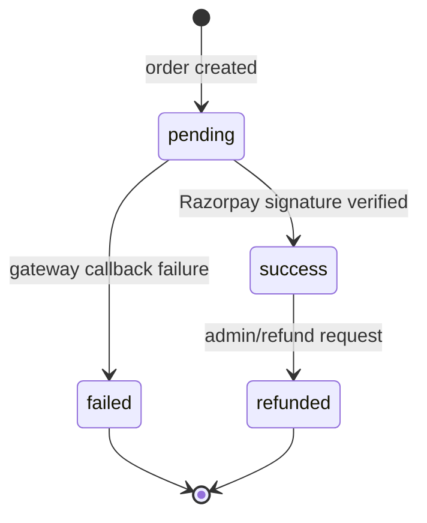
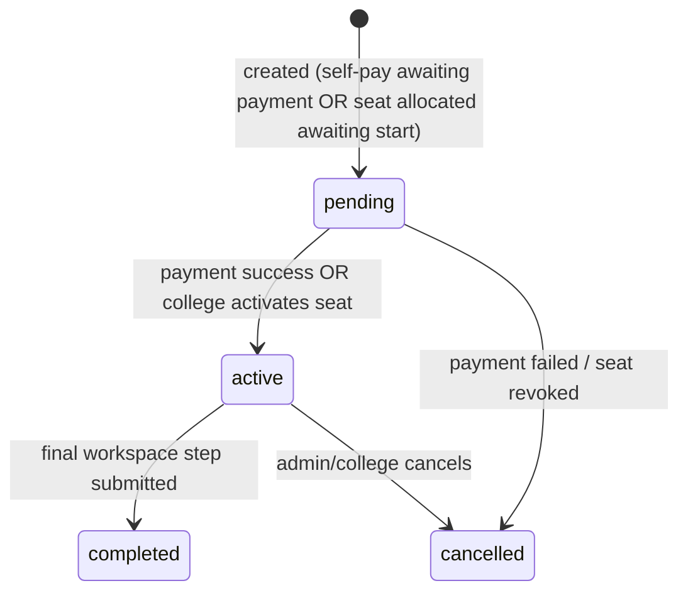
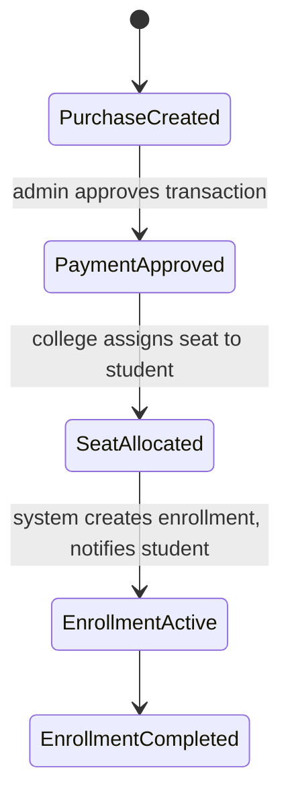

# Internship Management Platform — Architecture & Design

Grounded in the current `engineers-clinic` codebase (audited 2026-06-16). Every section is tagged:

- `[EXISTING]` — already implemented, described as-is
- `[GAP]` — partially implemented, needs a schema/code change
- `[NEW]` — does not exist yet, proposed from scratch

**Key terminology note:** the codebase has no separate "Internship" entity. The `courses` table is the catalog/checkout/workspace entity that the UI presents to students as **"projects"**. Rather than introduce a parallel `internships` table (which would fragment checkout, payments, and the workspace engine), this design treats **"Internship" = `Course` with `type = internship`**. If product wants a hard separation later, it's a one-column migration away from today's model — not a rewrite.

---

## 1. Complete Database Schema

### Existing tables (keep as-is)
| Table | Key columns | Notes |
|---|---|---|
| `users` | role_id, name, email, password, phone, avatar | `[EXISTING]` |
| `roles` / `permissions` / `role_permissions` | name | Custom RBAC, not Spatie. `[EXISTING]` |
| `colleges` | user_id, college_name, address, contact_number, payment_mode, utr_number, payment_status, payment_amount, payment_submitted_at, payment_reviewed_by/at, payment_rejection_reason, razorpay_* | `[EXISTING]`, but single-row-per-college payment state — see gap below |
| `students` | user_id, college_id, course_name, level | `[EXISTING]`. `level` (Beginner/Intermediate/Advanced) added 2026-06-16 to gate project-browsing by track — see §13a item #4. Missing GST/registration is on college, fine. |
| `courses` | title, slug, description, level, category, fee, duration_months, curriculum/modules/phases/faq (JSON) | `[EXISTING]` — doubles as "internship catalog" |
| `enrollments` | student_id, course_id, enrollment_date, progress, status(`ongoing`,`completed`) | `[GAP]` — status enum too narrow |
| `orders` / `payments` | razorpay_order_id/payment_id/signature, amount, status | `[EXISTING]` student payment rails |
| `course_workspaces`, `workspace_steps`, `task_progress`, `student_tasks` | — | `[EXISTING]` — internship "workspace" execution engine |
| `quizzes`, `certificates`, `attendance`, `notifications` | — | `[EXISTING]`, out of scope here |

### Schema changes needed

**`courses` — add internship/sponsorship support `[GAP]`**
```
ALTER TABLE courses ADD type ENUM('course','internship') DEFAULT 'course';
ALTER TABLE courses ADD is_sponsorable BOOLEAN DEFAULT false; -- can a college buy seats for this
```

**`enrollments` — wider status + sponsorship link `[GAP]`**
```
ALTER TABLE enrollments MODIFY status ENUM('pending','active','completed','cancelled') DEFAULT 'pending';
ALTER TABLE enrollments ADD sponsor_type ENUM('self','college') DEFAULT 'self';
ALTER TABLE enrollments ADD seat_allocation_id BIGINT NULL REFERENCES college_internship_seat_allocations(id);
-- data migration: existing 'ongoing' -> 'active'
```

**`payments` (student) — add Refunded `[GAP]`**
```
ALTER TABLE payments MODIFY status ENUM('pending','success','failed','refunded') DEFAULT 'pending';
-- data migration: existing 'completed' -> 'success'
```

**New: `college_payment_transactions` `[NEW]`**
Today a college's payment state lives as single columns on `colleges` — fine for "buy dashboard access once," but breaks once a college buys seats more than once. Move history into its own table; keep `colleges.payment_status` as a cached "is the account currently active" flag.
```
id, college_id FK, purpose ENUM('dashboard_access','seat_purchase'),
amount DECIMAL(10,2), payment_mode ENUM('online','offline'),
status ENUM('pending','verification_pending','approved','rejected'),
razorpay_order_id, razorpay_payment_id, razorpay_signature,
utr_number, payment_proof_path,   -- <-- screenshot upload, the listed Issue
submitted_at, reviewed_by FK users, reviewed_at, rejection_reason,
timestamps
```

**New: `college_internship_purchases` `[NEW]` (Scenario A — sponsorship)**
```
id, college_id FK, course_id FK (the internship), transaction_id FK college_payment_transactions,
seats_purchased INT, seats_used INT DEFAULT 0, price_per_seat DECIMAL(10,2),
timestamps
```

**New: `college_internship_seat_allocations` `[NEW]`**
```
id, purchase_id FK college_internship_purchases, student_id FK students,
enrollment_id FK enrollments NULLABLE, allocated_by FK users, allocated_at,
timestamps
UNIQUE(purchase_id, student_id)
```

This is the only structurally new part of the model — everything else is widening an enum or adding a column.

---

## 2. Laravel Migration Structure

Run in this order (each is one migration file):

1. `alter_enrollments_status_and_sponsor_columns`
2. `alter_payments_status_add_refunded`
3. `alter_courses_add_type_and_sponsorable`
4. `create_college_payment_transactions_table`
5. `backfill_college_payment_transactions_from_colleges` (data migration, not schema)
6. `create_college_internship_purchases_table`
7. `create_college_internship_seat_allocations_table`
8. `add_seat_allocation_id_to_enrollments_table` (separate from #1 to keep FK creation isolated after seat_allocations exists)

Each enum widening should be done via `DB::statement('ALTER TABLE ... MODIFY ...')` (Laravel doesn't generate enum diffs from `Schema::table`), guarded by `down()` that reverts the enum and re-maps data.

---

## 3. Models & Relationships

```
Course
 ├─ hasMany Enrollment
 ├─ hasMany Payment
 ├─ hasMany CollegeInternshipPurchase           [NEW]
 └─ scope: internships() -> where('type','internship')

Enrollment
 ├─ belongsTo Student
 ├─ belongsTo Course
 └─ belongsTo CollegeInternshipSeatAllocation (nullable)   [NEW]

College
 ├─ hasMany Student
 ├─ hasMany CollegePaymentTransaction            [NEW] (replaces inline payment columns going forward)
 └─ hasMany CollegeInternshipPurchase            [NEW]

CollegeInternshipPurchase                        [NEW]
 ├─ belongsTo College
 ├─ belongsTo Course
 ├─ belongsTo CollegePaymentTransaction
 └─ hasMany CollegeInternshipSeatAllocation
     accessor: seatsRemaining() = seats_purchased - seats_used

CollegeInternshipSeatAllocation                   [NEW]
 ├─ belongsTo CollegeInternshipPurchase
 ├─ belongsTo Student
 └─ belongsTo Enrollment (nullable, set once enrollment is created)

CollegePaymentTransaction                         [NEW]
 ├─ belongsTo College
 └─ belongsTo User (reviewed_by)
```

`Student`, `User`, `Payment`, `Order` keep their current shape — no changes required.

---

## 4. REST APIs

`[GAP]` — there is currently **no `routes/api.php`** usage; everything is session-based Blade controllers. Adding a full REST layer is a meaningful scope increase, so propose it as additive (Phase 3 in the roadmap), via Sanctum tokens, not a replacement for existing web routes:

```
POST   /api/v1/auth/login
POST   /api/v1/colleges                          -- signup
GET    /api/v1/colleges/{id}/payment-status
POST   /api/v1/colleges/{id}/payments             -- online or offline (multipart for screenshot)
GET    /api/v1/colleges/{id}/students
POST   /api/v1/colleges/{id}/students             -- single add
POST   /api/v1/colleges/{id}/students/bulk        -- bulk import (reuse EnrollmentBulkImportService)
GET    /api/v1/internships                        -- catalog (Course where type=internship)
POST   /api/v1/colleges/{id}/internship-purchases -- buy seats (Scenario A)
POST   /api/v1/internship-purchases/{id}/allocate -- assign a purchased seat to a student
GET    /api/v1/students/{id}/enrollments
POST   /api/v1/students/{id}/enrollments          -- self-pay enroll (Scenario B, triggers checkout)
POST   /api/v1/payments/student/create-order
POST   /api/v1/payments/student/verify
GET    /api/v1/admin/colleges?status=pending
POST   /api/v1/admin/colleges/{id}/approve
POST   /api/v1/admin/colleges/{id}/reject
GET    /api/v1/reports/{revenue|enrollments|colleges|students}
```

Auth: Sanctum personal access tokens scoped by role; reuse existing `CheckRole` logic as a route-level ability check.

---

## 5. Admin Workflows

```
[EXISTING] College approval / suspension, offline payment verification — Admin/DashboardController
[EXISTING] Student & enrollment management, course/quiz/certificate admin
[NEW]      Approve college seat-purchase transactions (college_payment_transactions, purpose=seat_purchase)
[NEW]      Monitor seat utilization per college (seats_purchased vs seats_used) — feeds Reports
[GAP]      Revenue report must now split "self-pay student revenue" vs "college sponsorship revenue"
```

Admin review queue becomes: `college_payment_transactions.status IN (pending, verification_pending)` ordered by `submitted_at`, with `payment_proof_path` rendered inline for offline/UTR review.

---

## 6. College Workflows

**Scenario A — College sponsors (seats):**
```
College logs in -> Internship catalog (is_sponsorable=true) -> chooses internship + seat count
  -> CollegeInternshipPurchase created (status=pending) -> CollegePaymentTransaction (online or offline)
  -> Admin approves transaction -> purchase becomes usable (seats_used starts at 0)
  -> College allocates seats to existing/new students -> CollegeInternshipSeatAllocation created
  -> Enrollment created automatically: sponsor_type=college, status=pending->active, no Payment row
  -> OnboardingMailer notifies student with credentials (reuse existing mailer)
```
Rule enforced at allocation time: reject if `seats_used >= seats_purchased`.

**Scenario B — Student pays individually:** unchanged from what exists today (Course checkout -> Order -> Payment -> Enrollment), just tag `sponsor_type=self`.

---

## 7. Student Workflows

`[EXISTING]`, no structural change:
```
Login -> Dashboard (home.blade.php)
 -> Browse catalog (studentProjects, filtered by level) -> select internship
    -> if sponsored seat already allocated: instant activation, skip payment
    -> else: checkout -> Razorpay -> Payment success -> Enrollment(status=active)
 -> Workspace (sequential steps) -> Submit project -> Enrollment(status=completed)
```
Only change: `enrollmentStore`/auto-enroll paths must check for an unused seat allocation before sending the student to checkout.

---

## 8. Payment Workflows

**College payment (online/offline):**


**Student payment (online only):**


---

## 9. State Diagrams

**Enrollment lifecycle:**


**College → seat purchase → student activation (Scenario A end-to-end):**


---

## 10. Role & Permission Matrix

Existing custom RBAC (`roles`/`permissions`/`role_permissions`, `CheckRole` middleware) — no Spatie needed.

| Module | Admin | College | Student |
|---|---|---|---|
| College approval/suspension | CRUD | — | — |
| Verify offline payments (college) | CRUD | Submit only | — |
| Internship catalog (create/price) | CRUD | Read | Read |
| Seat purchase | Approve | Create/Read own | — |
| Seat allocation | Read all | CRUD own students | — |
| Student management | Read all, reset password | CRUD own students | Edit own profile |
| Enrollment management | Read all, override status | CRUD own college's | Read own |
| Student payment (self-pay) | Read all, refund | — | Create own |
| Reports (revenue/enrollments/etc.) | Full | Own-college scoped subset | — |

Seed `permissions` rows: `college.payment.verify`, `internship.seat.allocate`, `enrollment.status.override`, `report.revenue.view`, etc., mapped via `role_permissions`.

---

## 11. Dashboard Wireframes (text)

**College Dashboard**
```
┌─────────────────────────────────────────────────────┐
│ Logo   Students  Enrollments  Internships  Settings  │
├─────────────────────────────────────────────────────┤
│ Stats: [Students: 120] [Active Enr: 45] [Seats: 30/50]│
│ ┌──────────────┐ ┌──────────────┐                    │
│ │ Enrollment    │ │ Seat usage    │                   │
│ │ trend chart   │ │ by internship │                   │
│ └──────────────┘ └──────────────┘                    │
│ [+ Buy Internship Seats]  [+ Add Student]  [Bulk Import]│
└─────────────────────────────────────────────────────┘
```

**Student Dashboard**
```
┌─────────────────────────────────────────────────┐
│ My Internships | Browse Catalog | Profile | Orders│
├───────────────────────────────────────────────────┤
│ If sponsored: "Your college sponsored this — no   │
│ payment needed" banner on the catalog card.        │
│ [Internship Card] progress bar, Continue/Start btn │
└─────────────────────────────────────────────────┘
```

**Admin Dashboard**
```
┌─────────────────────────────────────────────────┐
│ Review Queue: Colleges Pending | Seat Purchases   │
│ Pending                                            │
│ ┌─ College: ABC Engg | UTR: 12345 | [proof.png] ─┐│
│ │ [Approve] [Reject + reason]                     ││
│ └──────────────────────────────────────────────────┘│
│ Reports: Revenue (self-pay vs sponsored split)      │
└─────────────────────────────────────────────────┘
```

---

## 12. Development Roadmap

| Phase | Scope | Notes |
|---|---|---|
| **Phase 1 (1 wk)** | Fix listed issues: student password field, enrollment "select student" / "status" dropdowns, offline payment screenshot upload | Touches existing controllers/views only, no new tables except `payment_proof_path` |
| **Phase 2 (2 wks)** | Enrollment status enum widen + `sponsor_type`; `college_payment_transactions` table + migrate existing college payment data | Backfill migration required |
| **Phase 3 (2-3 wks)** | Seat purchase model: `college_internship_purchases`, `college_internship_seat_allocations`, allocation UI, auto-enrollment on allocation | Core Scenario A feature |
| **Phase 4 (2 wks)** | REST API layer (Sanctum) for the endpoints in §4 | Additive, doesn't touch web routes |
| **Phase 5 (1-2 wks)** | Reports: revenue split, seat utilization, enrollment funnel | Read-only, low risk |

---

## 13. Testing Checklist

- [ ] Enrollment status enum migration: existing `ongoing` rows readable as `active` post-migration
- [ ] Seat allocation rejects when `seats_used >= seats_purchased` (race condition: wrap in `DB::transaction` + `lockForUpdate`)
- [ ] Student with an allocated seat is never shown a checkout/payment screen
- [ ] Razorpay webhook signature verification rejects tampered payloads (existing + new seat-purchase endpoint)
- [ ] Offline payment screenshot: file type/size validated, stored outside public web root or via signed URL
- [ ] Admin reject requires a non-empty reason; college can resubmit after rejection
- [ ] College report numbers only ever include that college's own students (tenant isolation)
- [ ] Bulk student import: duplicate email handling, partial-failure rollback (`EnrollmentBulkImportService` already has this — regression-test after enum changes)
- [ ] Role middleware blocks cross-role access to all new seat-purchase/allocation routes

---

## 13a. QA-Reported Issues — Student Section (source: "EC Student section Testing.pdf")

Raw QA pass over the live student flow. Status reflects the working tree as of 2026-06-16 (`DashboardController.php`, `student-overview.blade.php`, `projects/index.blade.php` have uncommitted fixes in progress).

| # | Issue | Status | Notes |
|---|---|---|---|
| 1 | Signup as student shows 404 | `[OPEN]` | Not touched by current diff — check `routes/web.php` student signup route registration |
| 2 | Edit profile — image update not working | `[OPEN]` | Not touched by current diff |
| 3 | Browse projects should cap selection at 3 | `[FIXED in WIP]` | `studentProjects()`/`studentSelectProject()` now compute `totalSelected` and reject a 4th selection; UI shows "Limit Reached (3/3)" and a `3/3` banner |
| 4 | Beginner-track students should only see/add Beginner projects | `[FIXED in WIP]` | Resolved per product decision: students.level column added (migration `2026_06_16_104715_add_level_to_students_table`, backfilled from existing enrollments); college now sets the level on Add Student / Enrollment / bulk import; `DashboardController::studentProjects()`/`studentSelectProject()` gate selection to the student's assigned level (3-project cap still applies within that level) |
| 5 | Completed project still shows "not completed" | `[OPEN]` | Progress is now computed from `course_workspaces`/`workspace_steps` (`studentWorkspaceSteps`) in the overview, but no fix confirmed for the screenshot's specific enrollment — needs repro against a real completed enrollment |
| 6 | "Change Project" button not working | `[OPEN]` | No `change project` handler found in the diff; only select/limit logic changed |
| 7 | Selecting any project redirects to the same one project | `[FIXED in WIP, needs verify]` | Root cause was projects being keyed by `course_id` while curriculum items weren't disambiguated; `studentProjects()` now iterates `course->curriculum` items individually (`item_index`) and `studentSelectProject` redirects to the dashboard instead of a hardcoded workspace — re-test the original repro case |
| 8 | Show "Purchase course details" in profile | `[OPEN]` | Profile dashboard work, not in current diff |
| 9 | Show direct payment option right after signup | `[OPEN]` | Not in current diff |
| 10 | Add profile icon in navbar | `[OPEN]` | Not in current diff |
| 11 | Billing & purchase — view payment details broken; email payment confirmation to student | `[OPEN]` | Not in current diff; relates to §6/§8 payment workflows above |
| 12 | Improve "My Profile" dashboard | `[OPEN]` | Not in current diff |

**Cross-reference:** items 3, 6, 7 overlap with the catalog/enrollment UX covered in [§7 Student Workflows](#7-student-workflows); items 9, 11 overlap with [§8 Payment Workflows](#8-payment-workflows). Item 1 (signup 404) and 2/10/12 (profile/navbar) are outside this design doc's current scope (auth routing, profile module) and aren't modeled in §1's schema — flag as a fast-follow before Phase 1 sign-off in [§12 Development Roadmap](#12-development-roadmap).

---

## 14. Production Deployment Checklist

- [ ] Run new migrations with `--force`, take a DB backup immediately before
- [ ] Backfill script for `college_payment_transactions` from existing `colleges` payment columns, verified row-count match before cutover
- [ ] `php artisan storage:link` for payment-proof screenshot uploads; confirm upload directory isn't web-listable
- [ ] Razorpay webhook secret + offline payment review email notifications configured in production `.env`
- [ ] Queue worker running for `OnboardingMailer` (student credential emails) — currently synchronous, confirm mail driver timeout won't block requests at scale
- [ ] Re-seed `permissions`/`role_permissions` for new abilities (`internship.seat.allocate`, etc.)
- [ ] Smoke test both payment scenarios (online Razorpay + offline UTR) in production with a real low-value transaction before go-live
- [ ] Confirm `enrollments.status` enum change didn't break any raw SQL/report queries outside Eloquent (grep for `'ongoing'`/`'completed'` string literals)
